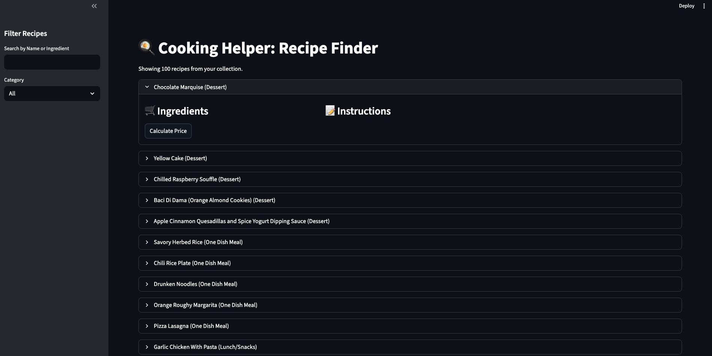
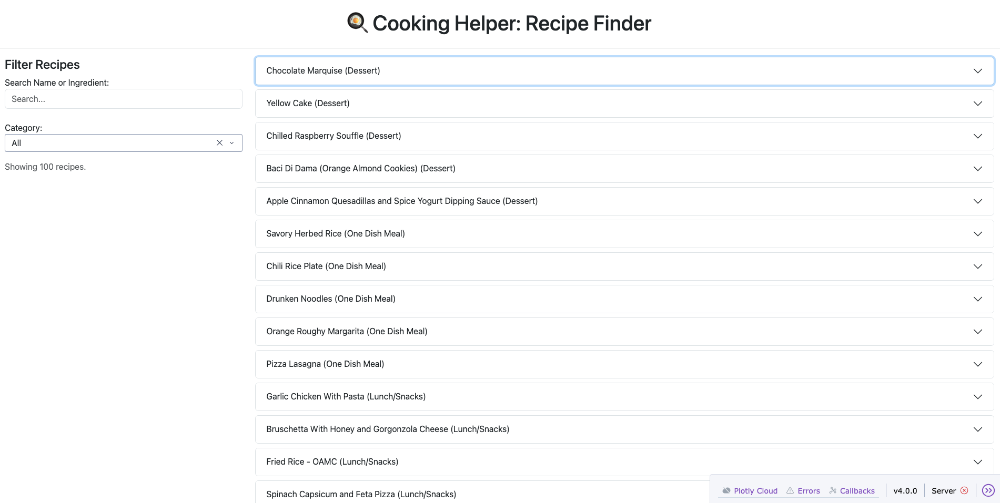

# Technology Review

Technology Review: Python Web Frameworks for Data Tools

### 1. Background

Our project requires a user interface that allows for interactive recipe searching, ZIP-code-based location filtering, and dynamic pricing displays using the Kroger Development API. Therefore, we need a framework that can handle:

User Inputs: Real-time text search and ZIP code entry.

API Integration: Secure handling of OAuth2 tokens and asynchronous product queries.

Data Visualization: Clear, interactive display of grocery prices and the ingredients for the recipe.

### 2. Technology Candidates

**Streamlit**

Author: AbdulMajed, Alexander Martin, Andrej Baranovskij, Adrien TreuilleSnowflake (formerly Streamlit Inc.)

Summary: An open-source Python library that turns data scripts into shareable web apps in minutes. It uses a declarative, top-down execution model where the entire script reruns every time a user interacts with a widget.

Target Audience: Data scientist focused on rapid prototyping.

Pros of using Streamlit: Simple to use, great for small-scale app development, might be more intuitive to use.

Cons of using Streamlit: Less customization features, running top-down execution could make the app run slower.

**Plotly Dash**

Author: Chris Parmer, Plotly

Summary: A productive Python framework for building analytical web applications. It is built on top of Flask (web server), Plotly.js (charts), and React.js (UI). It uses an event-driven model with explicit callbacks.

Target Audience: Data scientists building complex, scalable, or highly customized dashboards.

Pros of using Plotly Dash: Highly customizable, great for larger datasets.

Cons of using Plotly Dash: More complex to use, more integration with HTML and CSS. 

## Side by Side Comparison

As you can see, since this is a very basic implementation right now, they look very similar. However, we are using a small dataset for this demo and ultimately we want the option of more customization for our future features. 

## Our Choice

We ultimately decided to use Plotly Dash because we can do more customization for our app. Streamlit has a pretty rigid format whereas Plotly Dash will give us more flexibility for how we present our deliverable. We want our users to be able to remove items or choose alternatives from the shopping cart for ingredients that they already have. If we used Streamlit then we would have the entire page refreshing. One concern is that none of us have used Plotly Dash before so this is new for all of us and there is a steeper learning curve compared to Streamlit. Deployment might also be a little bit more complicated. We will need to look into Render, which is what the Plotly team recommends as the free option to deploy.
