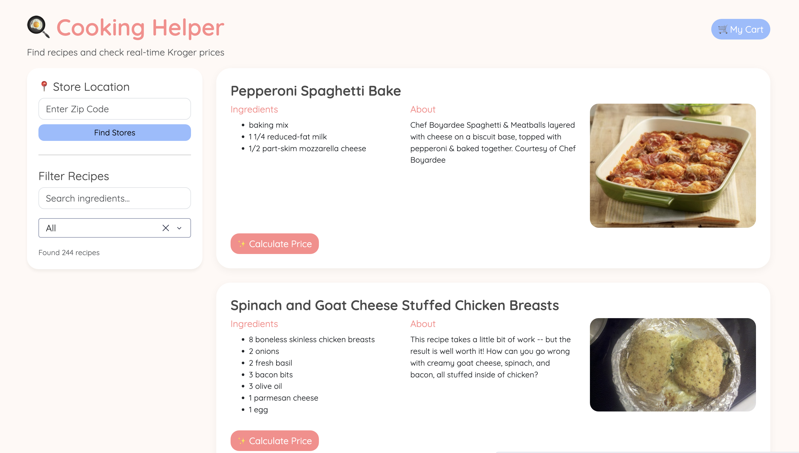
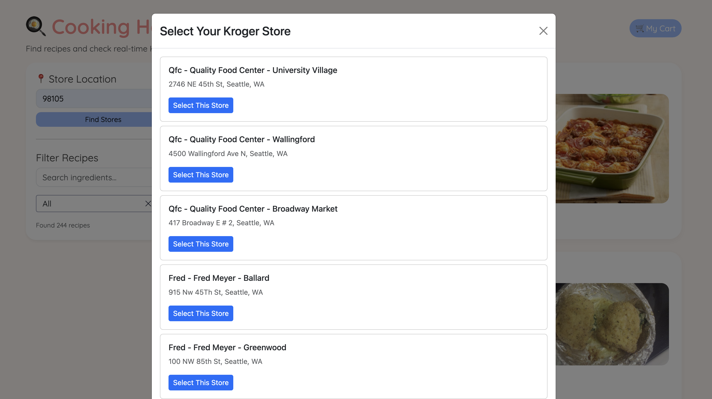
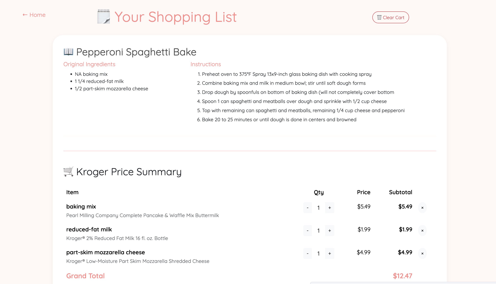

# For Collaborators -- How to Run/Deploy Our Project

The following instructions are to be performed in a command line interface from the root directory of the project:
- "git clone" the repository to download the latest version of the application
- Download conda, and creating a virtual environment from the environment.yml file, located at the root of the repository. 
    - The command for this is conda env create -f environment.yml.
- Run "python app/app.py"

The app will run on the URL: http://127.0.0.1:8050/

# How to Use App

- Enter your zip code
- Select your store of interest

- Scroll through recipes or search and press enter for a specific recipe
- Click calculate price
- Add quantities of ingredients or click the x if you don't want a certain ingredient

- Click clear cart if you don't want this recipe anymore
- Make your recipe!